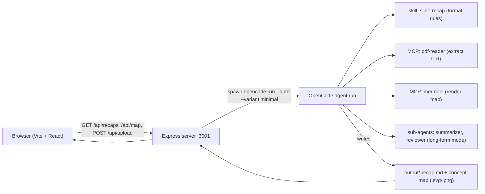
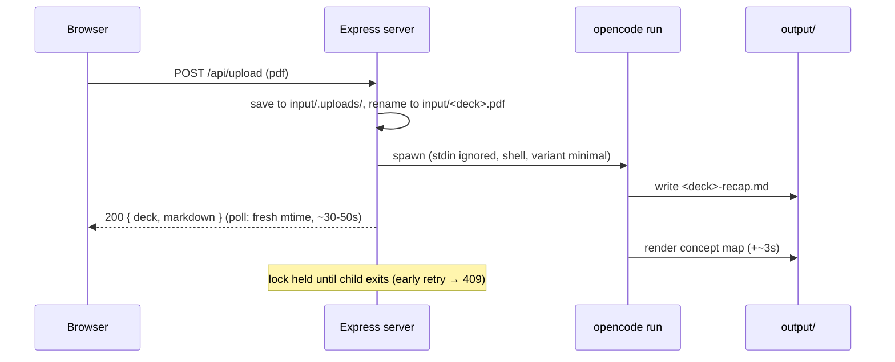

# ConceptCraft — Project Documentation

**ConceptCraft** turns course slide decks (PDF) into a structured recap (Markdown
with a live Mermaid concept map) in a single automated pass — with a small web UI to
browse recaps and trigger runs.

- **Harness:** [OpenCode](https://opencode.ai) (agent CLI)
- **Model:** `mimo-v2.6-flash-free` (provider `opencode`, agent `build`) — the same
  default model powers every stage: the main pass, the optional `summarizer` and
  `reviewer` sub-agents, and session/title generation. Runs use `--variant minimal`
  (lowest reasoning effort) to keep latency down.
- **Stack:** Vite + React (`frontend/`), Express (`server/`), plain JavaScript.

## Architecture



### Agent side (the pipeline)

| Piece | Where | Role |
|---|---|---|
| Skill `slide-recap` | `.opencode/skills/slide-recap/SKILL.md` | Fixed recap format: Key Concepts → Topic Summaries → Concept Map → Open Questions |
| MCP `pdf-reader` | `opencode.json` → `npx -y @johangorter/mcp-pdf-server` | `extract_pdf_text` — reads the deck's text layer |
| MCP `mermaid` | `opencode.json` → `npx -y mcp-mermaid` | Renders the flowchart to an SVG/PNG file |
| Sub-agents `summarizer`, `reviewer` | `.opencode/agents/` | Long-form mode only (the original manual workflow) |

### Web side

**Backend — `server/index.js` (port 3001, CORS, JSON errors)**

| Endpoint | Returns |
|---|---|
| `GET /api/recaps` | `[{ deck, mtime, hasMap }]` — scanned from `output/*-recap.md`, newest first |
| `GET /api/recaps/:deck` | recap Markdown (deck name validated `^[A-Za-z0-9_-]+$`, no path traversal) |
| `GET /api/map/:deck` | concept map as `image/svg+xml` or `image/png` (whichever exists) |
| `POST /api/upload` | multipart `pdf` → runs the pipeline → `{ deck, markdown }` |

**Frontend — `frontend/src/`**

| File | Role |
|---|---|
| `App.jsx` | state (list, selection, loading, error, upload), error banner + Retry, delayed list refresh |
| `components/Sidebar.jsx` | recap list + "Upload PDF" button |
| `components/RecapView.jsx` | tabs **Markdown / Concept map**; `react-markdown` with a custom `code` block that dispatches `language-mermaid` to `Mermaid.jsx` |
| `components/Mermaid.jsx` | `mermaid.render()` in an effect; parse failure degrades to raw source text |
| `api.js` | fetch helpers; Vite proxy `/api` → `:3001` |

## Upload sequence (the core feature)



Pipeline inside the run (fast path, one pass, no sub-agents):
read skill → extract PDF text once → write compact recap **and** call mermaid in the
same assistant message → move map to `output/` → done.

## How to run

```bash
npm install                 # express, cors, multer (root)
npm --prefix frontend install
npm run dev:server          # API  → http://localhost:3001
npm run dev:client          # UI   → http://localhost:5173  (proxies /api)
```

Open **http://localhost:5173**, click a sidebar recap, or upload a PDF
(it needs `opencode-ai` installed and authenticated).

- Production-ish: `npm run build:client` → the Express server serves `frontend/dist` if present.
- Timeout knob: `RUN_TIMEOUT_MS` env (default 60000). Run log: `server/last-run.log`.

## Performance & limits

- **Response time:** ~33-51 s measured (recap returned as soon as the file exists);
  hard cap 60 s → `504` with log tail if not done.
- **Errors:** `400` bad file/name · `404` missing · `409` run already in progress
  (including the few seconds while the map finishes) · `500` run failed · `504` timeout.
- Full run output is captured to `server/last-run.log`; failures return its tail as `detail`.

## Design decisions worth explaining

1. **Upload to `input/.uploads/` first, then `renameSync`.** The first version wrote
   straight to `input/<deck>.pdf` while the client was still sending that same file —
   multer truncated the source mid-upload and then deleted the partial file
   (two input PDFs were lost and restored from `Downloads/`). Atomic rename after the
   body completes makes re-uploads safe.
2. **`stdio: ['ignore', 'pipe', 'pipe']` on spawn.** With a piped stdin, `opencode run`
   waits for an EOF that never arrives and hangs before creating a session.
   Reproduced in isolation, then fixed.
3. **Respond on fresh recap mtime, not process exit.** Saves the ~25 s the map render
   takes after the recap is already written; the list refreshes after 12 s to pick up `hasMap`.
4. **Mermaid rendering twice:** the Markdown tab renders the ` ```mermaid ` block live
   in the browser (always works), while the static SVG/PNG tab uses whatever the
   mermaid MCP emitted — the agent sometimes produces PNG, so `/api/map` serves either.
5. **No sub-agents on the web path.** The original workflow (summarizer + reviewer
   cross-check, see `PLAN.md`/`RUN.md`) takes 10-23 min; the UI targets ~1 minute by
   doing a single compacted pass (`--variant minimal`).

## Verification (2026-10-06)

- Endpoint matrix: 200/400/404 incl. path-traversal checks; non-PDF 400;
  concurrent upload 409 with source PDF verified untouched.
- Full E2E upload: real deck → skill → extract → (long-form agents on first run) →
  map → recap returned; fast path re-verified at 33/51/51 s on three decks.
- Server-down → proxy 502 surfaces in the UI banner; restart → Retry recovers.
- `vite build` passes; React/markdown mapping unit-checked in Node.

See `PLAN.md` (agent pipeline), `PLAN-FRONTEND.md` (web plan + verification log),
`RUN.md` (manual long-form prompt), `README.md` (overview).
