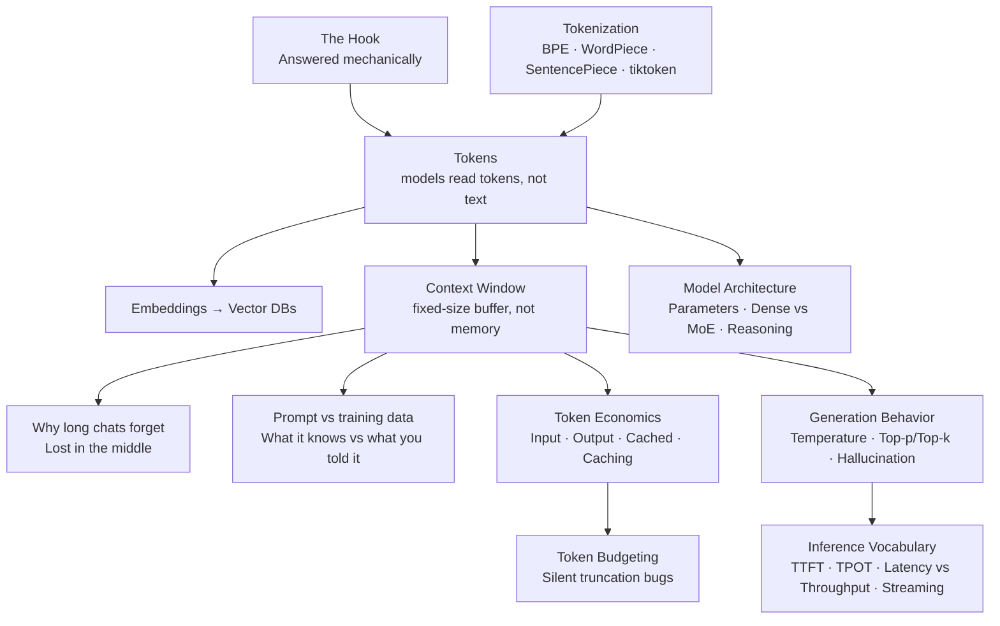
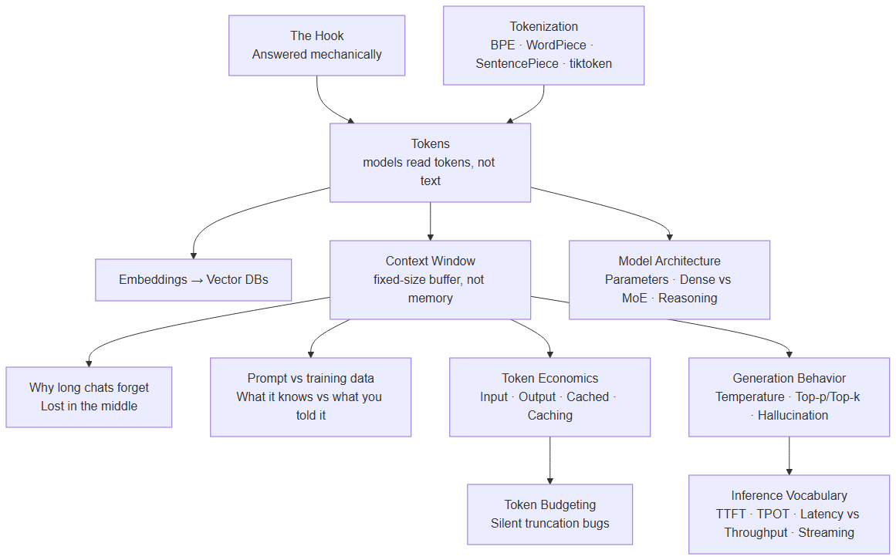

# AAPLecture1_LLM_Foundations — LLM Foundations: Tokens · Context · Inference
**Date:** 2026-10-03 (deck footer) · Day 1 · ASTRA · Track 1, Week 1

## Key Concepts
- Models read tokens, not text — one finite vocabulary covers endless text.
- Tokenizers differ: BPE (merge the most frequent pair, repeat), WordPiece (greedy longest match, `##` = continuation), SentencePiece (raw text, a space is just a symbol), tiktoken (OpenAI's fast byte-level BPE).
- Parameters are billions of tunable numbers; in Mixture of Experts only some experts run per token.
- Embeddings turn meaning into numbers, enabling search by meaning rather than keywords.
- The context window is a fixed-size input buffer, not memory — which is why long chats forget.
- Lost in the middle: attention isn't even inside the window.
- Temperature and top-p/top-k control randomness and which tokens are allowed next; hallucination is confident, plausible, wrong.
- Tokens cost money: billed per token, with input, output, and cached tokens priced differently, and repeated prefixes get cheaper via prompt caching.
- Everything competes for one window; naive truncation drops the oldest content first.
- Inference has its own vocabulary: TTFT, TPOT, latency vs. throughput, and streaming.

## Topic Summaries

### Part 1 · Core Mechanics
The deck opens with the hook — "Today we answer it mechanically, not vaguely" — and builds from the ground up: tokens as the model's unit of reading, then the tokenization schemes that produce them (BPE, WordPiece, SentencePiece, tiktoken). It then scales up to model anatomy (parameters, Dense vs. MoE, reasoning models, model types) and representation (embeddings, vector databases). The part closes by defining the context window as a fixed-size input buffer rather than memory, marking "Why long chats forget" as "The hook, answered," and noting lost in the middle: attention isn't even inside the window.

### Part 2 · Generation Behavior
This section covers what happens at generation time: temperature gives the same prompt different randomness, while top-p and top-k decide which tokens are even allowed next. Hallucination rounds it out — outputs that are confident, plausible, and wrong.

### Part 3 · Structure (Token Economics)
The focus shifts to what the model knows versus what you told it (prompt vs. training data) and to the economics: billing is per token, with input, output, and cached tokens each having its own cost, and prompt caching makes repeated prefixes cheaper. Budgeting follows — everything competes for one window — with a practical warning that naive truncation silently drops the oldest content first.

### Part 4 · Inference Vocabulary
Prompts cost time, too — not just correctness and cost. The vocabulary: TTFT (time to first token), TPOT (time per output token), and the trade-off between latency and throughput (start fast vs. serve many). Streaming explains why text appears word by word.

### Recap & Next Steps
The deck closes with a recap framed as "Five ideas, one answer." A four-option quiz (kahoot.com) checks recall of the material. The "Up next" slide points to Day 2 & 3: "Where we go from here."

## Concept Map

## Open Questions
- **The hook's original question** — the hook slide only says "Today we answer it mechanically, not vaguely"; the actual question being answered isn't in the extracted text.
- **"Types of models"** — the one-liner says "Pick the right kind for the job" but doesn't list which types.
- **"Five ideas, one answer"** — the recap slide's five ideas aren't itemized in the extracted text.
- **Day 2 & 3** — the "Up next" slide names the days but not their topics.
