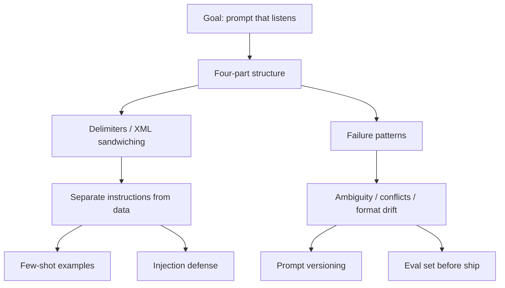

# Recap: AAPLecture2_Prompt_Engineering

**Date:** 2026-10-06 (deck dated 2026-10-03, Day 2 · GDG FastRack · Track 1, Week 1)

## Key Concepts

- Four-part prompt structure (models don't infer intent from tone)
- Delimiters / XML sandwiching to separate instructions from data
- Zero-shot, one-shot, and few-shot prompting
- Failure patterns: ambiguity, conflicting constraints, format drift
- Prompt injection as a production security risk
- Prompts as code: versioning and eval sets

## Topic Summaries

**Prompt structure.** A good prompt has four parts every time, and structure matters because models don't infer intent from tone alone. Vague prompts force the model to fill gaps with assumptions.

**Structuring techniques.** Wall-of-text prompts blur where the task ends and the data begins; tagging every section with XML (or fences, dashes, headings) makes the seams visible. The principle beats the syntax — models have read massive amounts of markup — and the same structure later doubles as a defense against injection.

**Zero to few-shot.** Zero-shot gives only the instruction, one-shot adds a single example showing what "done" looks like, and few-shot stacks several examples for more stable output. More examples = more consistency in format and style.

**Failure patterns and production concerns.** Prompts fail predictably (ambiguity, conflicting constraints, format drift, self-contradiction in long chains), so production systems defend them: structured input against prompt injection, version control since prompts are code, and a small eval set run before shipping changes.

## Concept Map

## Open Questions

- Slides only previewed it: how much does structured input actually stop injection vs. just raise the bar?
- How large should an eval set be before diminishing returns?
