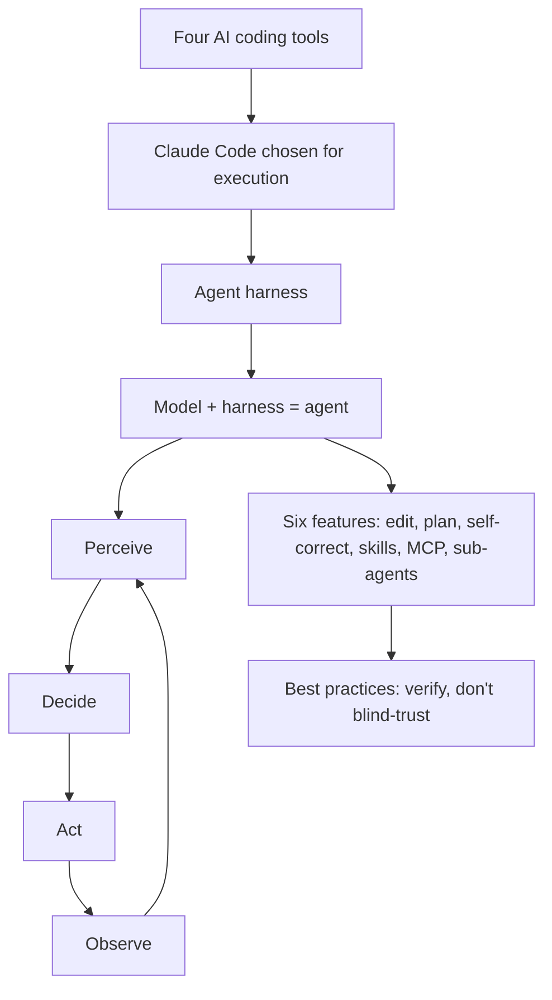

# Recap: AI Coding Techniques

Deck: **AAPLecture3 — AI Coding Techniques** · 2026-10-03 · ASTRA, Track 1 Week 1

## Key Concepts

1. **Four-tool landscape** — Claude Code, Cursor, Copilot, Windsurf: same pattern, different defining surface.
2. **Claude Code as the pick** — chosen for execution (live building), not as a verdict on the other three.
3. **Agent harness** — not a smarter chatbot: a model wired into a perceive → decide → act → observe loop.
4. **Model + harness = agent** — the model proposes, the harness executes; the environment joins the conversation.
5. **Six agentic features** — file editing, plan mode, self-correction on errors, skills, MCP, sub-agents.
6. **Trust but verify** — best practices mean knowing exactly where to look rather than blind trust.

## Topic Summaries

**Part 1 · The Landscape.** Four tools get a quick tour with one defining trait each, compared by strength and typical use. The point is the shared shape of the market, not a winner-takes-all ranking.

**Part 2 · Why Claude Code.** One tool is selected for today's execution: building, not surveying. The choice scopes the workshop while acknowledging the others remain viable.

**Part 3 · The Agent Harness.** The core idea: a harness is everything around the model, running a perceive/decide/act/observe loop the tool already ships — you extend it. All four tools follow this same architecture behind different surfaces.

**Part 4 · Concepts + Live Build.** Six features demonstrate the harness in action: agentic file editing, plan mode before acting, running code and fixing its own errors, reusable skills, MCP (host/client/server) for reaching outside the codebase, and sub-agent delegation. A best-practice checklist closes with verification habits, then a recap of seven ideas and a pointer to Week 2 (building agents, not just using them).

## Concept Map

## Open Questions

- The extracted text lists only slide titles; per-slide detail (comparison table rows, checklist items) lives in visuals the text layer didn't capture.
- What exactly Week 2's "build your own agent" covers versus today's harness extensions.
