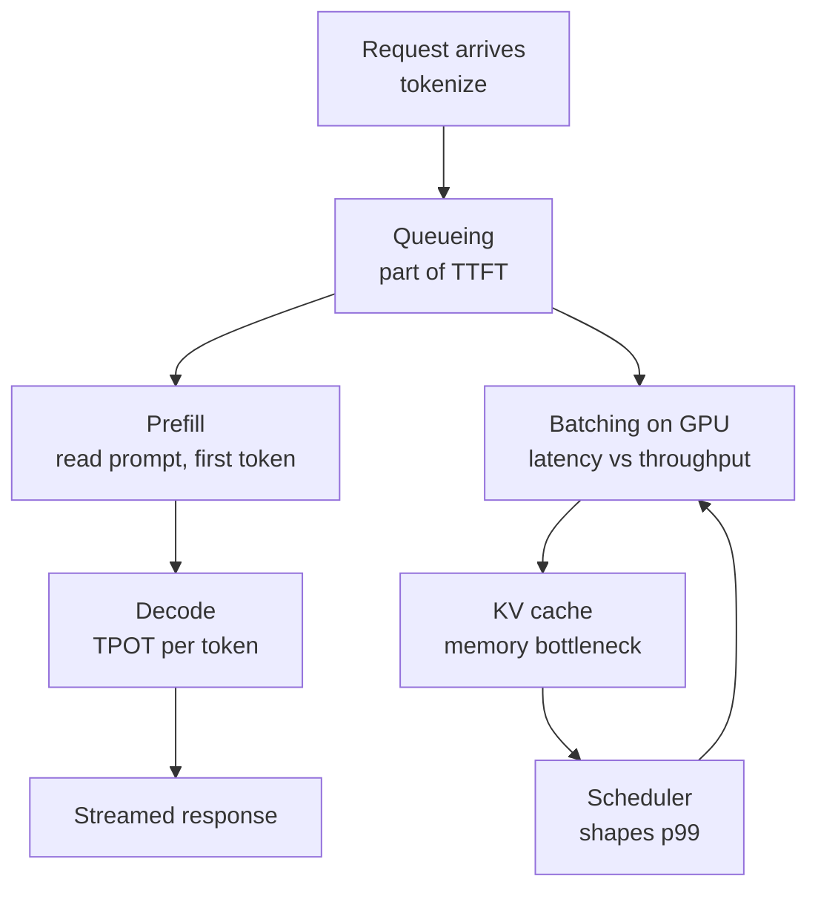

# Recap — AAPLecture4_Inference_Basics

**Deck:** Inference Basics (Day 4 · ASTRA · Online Session) · **Slides dated:** 2026-10-04

## Key Concepts

1. **TTFT = queueing + prefill** — time to first token includes waiting for a slot plus reading the whole prompt.
2. **TPOT** — decode produces tokens one at a time; the gap between tokens sets streaming speed. Total latency ≈ TTFT + (output tokens − 1) × TPOT.
3. **Six-stage pipeline** — arrival → queueing → prefill → decode → batching → streaming.
4. **KV cache** — each token's keys/values computed once and reused; ~0.8 MB per token for a 13B model, competing with weights for GPU memory.
5. **Continuous batching** — refill a freed slot at the next iteration instead of waiting for the slowest request.
6. **Latency–cost–quality trade-off** — model choice is per-request, ideally routed: small/fast for easy tasks, large/careful for hard ones.

## Topic Summaries

### The inference pipeline
Every request tokenizes, may wait in a queue (often dominating TTFT under load), runs prefill to build state and emit the first token, then decodes token by token while sharing the GPU via batching. Longer prompts raise TTFT; decode cadence sets TPOT.

### KV cache and memory
Attention needs every earlier token's K and V, so caching avoids recomputation — but stores them for every token, layer, and batched request. This competes with model weights and caps how many requests fit at once; wasted cache (fragmentation, over-reservation) starves batch size.

### Batching, scheduling, and observability
Static batching idles finished slots; continuous batching keeps the GPU full. The scheduler slices long prompts and evicts on KV exhaustion, shaping p99 — so teams monitor TTFT/TPOT percentiles, queue and cache health rather than averages.

### Trade-offs and failures at scale
Bigger models are stronger but slower and pricier; a router picks per request (preview of Day 10). Real incidents — polluted tokenizers (SolidGoldMagikarp, GPT-4o spam tokens), Anthropic's misrouted requests, vLLM's 60–80% KV waste fixed by PagedAttention — show how pipeline concepts map to symptoms.

## Concept Map

## Open Questions

- How should p99 TTFT/TPOT targets translate into concrete queue-depth and KV-cache budgets? (deferred to Day 10, observability)
- At what point does router complexity outweigh picking one model? (preview of Day 10)
