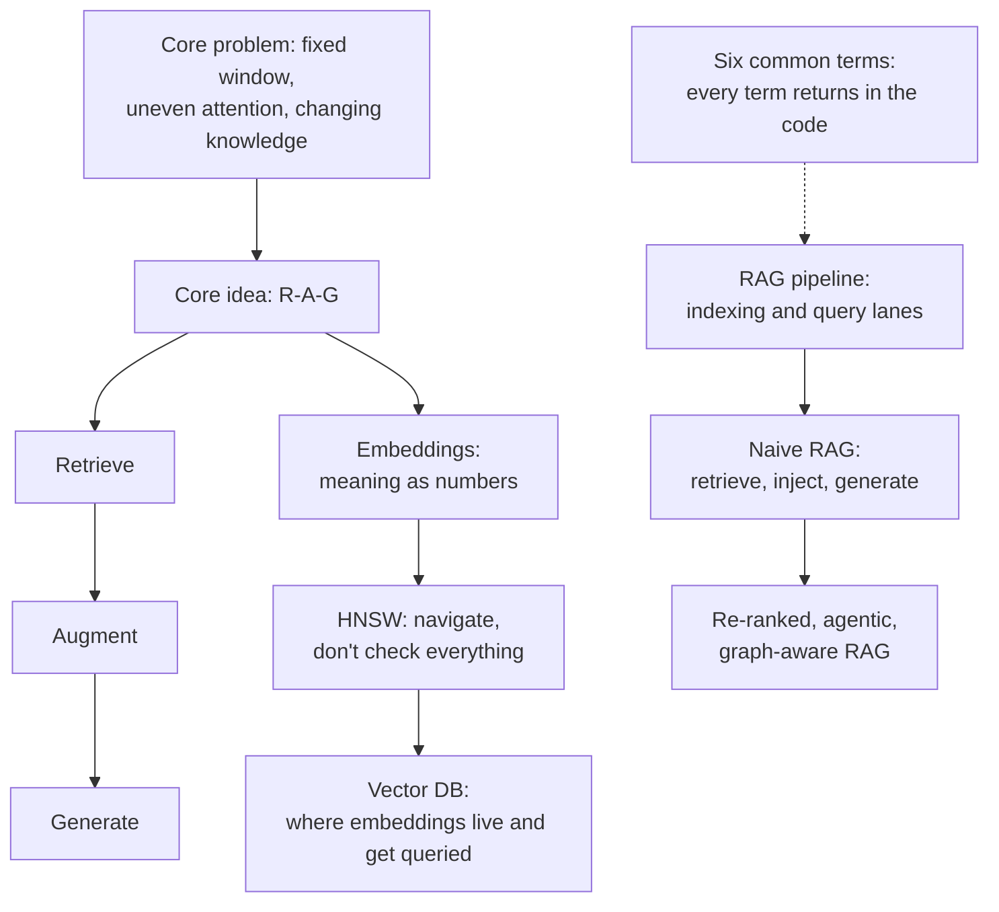

# AAPLecture5_RAG_Fundamentals — RAG Fundamentals
**Date:** 2026-10-06 (deck footer)

## Key Concepts
- RAG gives the model knowledge it doesn't already have.
- The core problem: fixed window, uneven attention, changing knowledge.
- The core idea R-A-G: retrieve, augment, generate.
- Embeddings are meaning as numbers, the real version.
- Semantic relationships: close in meaning means close in space.
- Brute-force comparison does not scale, so you need a database.
- HNSW is fast approximate search: navigate, don't check everything.
- Vector DBs are where embeddings live and get queried.
- The RAG pipeline has two lanes: indexing and query.
- RAG types: naive (the baseline), re-ranked, agentic, graph-aware.

## Topic Summaries

### Why RAG Exists
The core problem is stated as a fixed window, uneven attention, and changing knowledge. The core idea, R-A-G, is retrieve, augment, generate — giving the model knowledge it doesn't already have.

### Vector Databases
Embeddings turn meaning into numbers, and close in meaning means close in space. Brute-force comparison does not scale, which is why a database is needed at all; HNSW gives fast approximate search by navigating rather than checking everything. Vector DBs are where embeddings live and get queried.

### Common Terms
This part is a vocabulary consolidation: six terms, one line each. Its stated purpose is that every term returns in the code.

### The RAG Pipeline
Part 4 presents the full map of the RAG pipeline. It is divided into two lanes: indexing and query.

### Types of RAG
Naive RAG is the baseline (retrieve, inject, generate), and re-ranked RAG retrieves more, then re-ranks for precision. Agentic RAG makes retrieval the model's decision, while graph-aware RAG concerns relationships between chunks, not just similarity. The part closes by framing the deck's focus as the clean baseline every other type builds on.

### Recap / Next Up
The recap condenses the deck into six ideas, one answer. Up next is Day 5: RAG that works well.

## Concept Map

## Open Questions
- Slides 4–8 (Vector Databases): only a title and one-line teaser each; no detail on what embeddings are, how semantic proximity is measured, or which vector DBs are covered.
- Slide 9 (Vocabulary consolidation): the six terms themselves are not present in the extracted text — only "Six terms, one line each."
- Slide 11 (The full map): the two lanes are named (indexing and query) but no pipeline steps are listed.
- Slides 12–15 (RAG types): each type has only a one-line teaser, with no mechanics or examples.
- Slide 16 (Which one are we building?): the teaser says "The clean baseline every other type builds on" but does not explicitly name the chosen type.
- Slide 17 (Recap): "Six ideas, one answer" is not enumerated in the extracted text.
